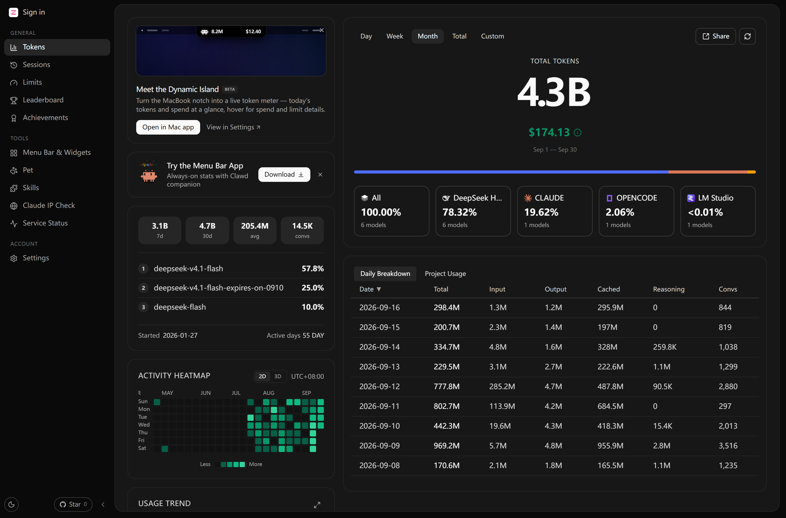
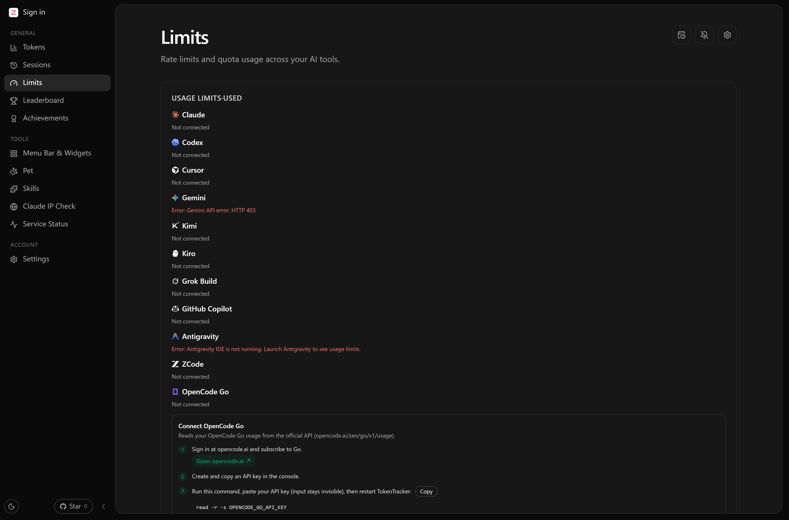
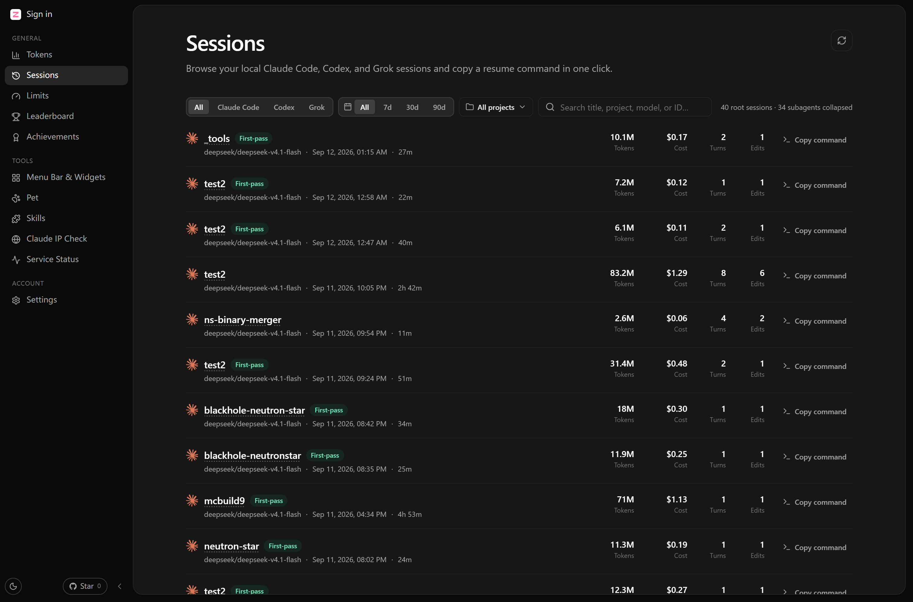
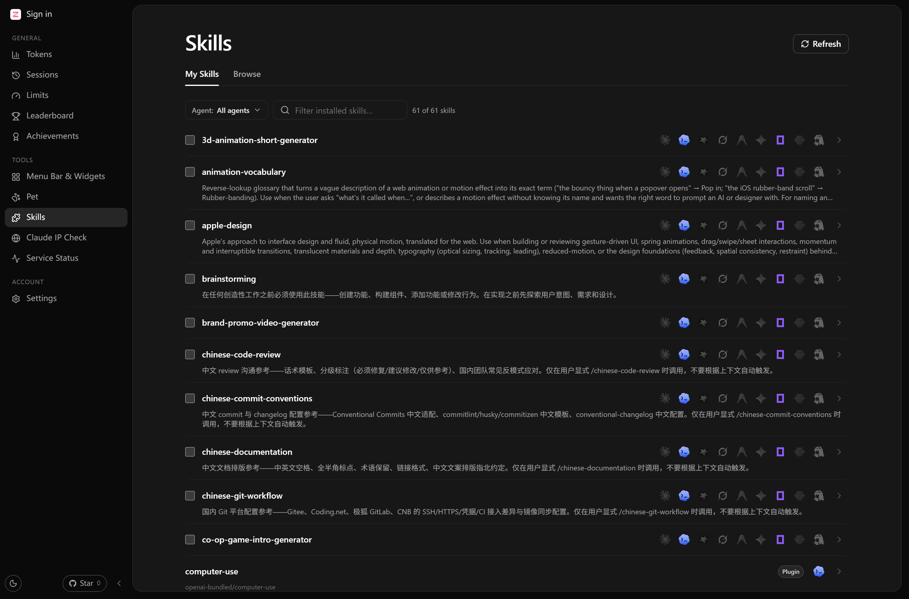
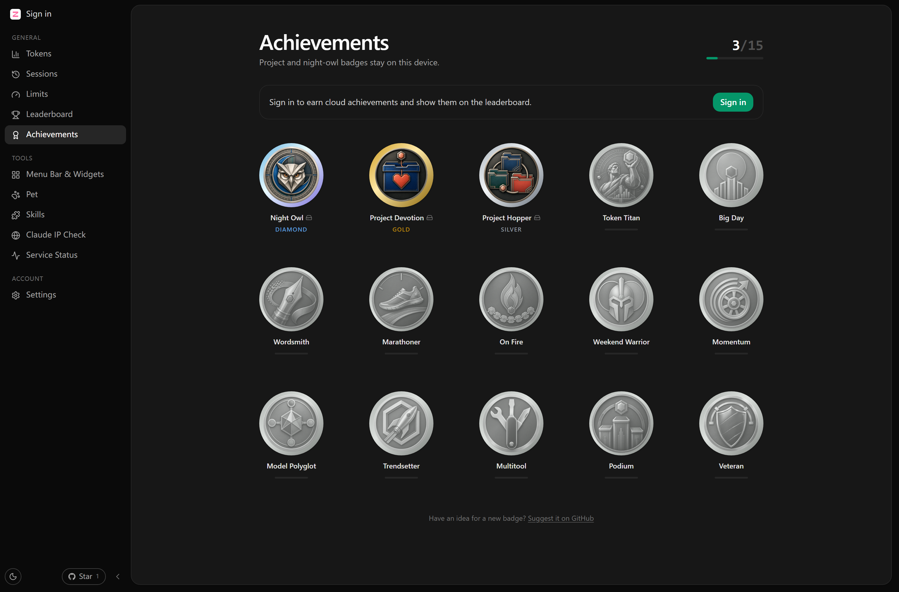
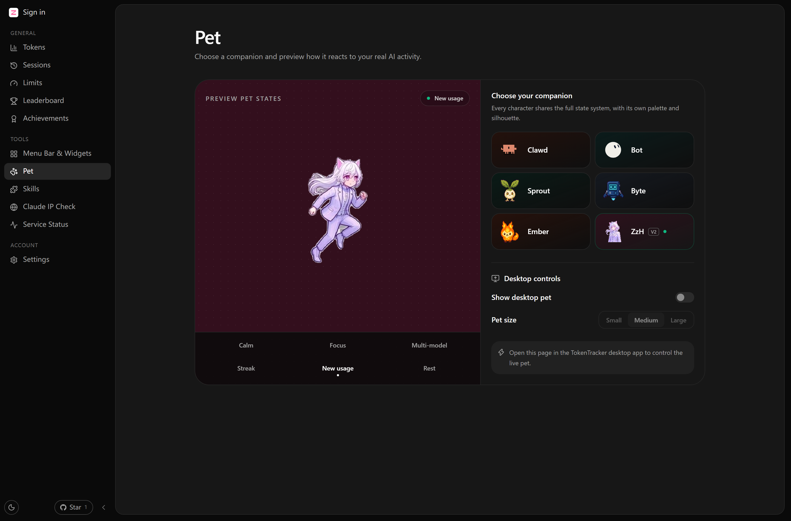

 <div align="center">


# TokenTracker ZzH

**This is my own custom-tuned build of [xiufengsun/TokenTracker](https://github.com/xiufengsun/TokenTracker)** — the same tracker with my own changes on top: the backend switched to my own server, ZzH as the default desktop pet, no OAuth, and its own deep-link scheme, port and icon so it can sit next to the original without either build hijacking the other.

**English** · [简体中文](./README.md) · [日本語](./README.ja.md) · [한국어](./README.ko.md) · [Deutsch](./README.de.md)

### Track every AI token — then bring your usage to life

An accurate, local-first token usage and cost dashboard for **39 AI coding tools** — plus a desktop pet, native widgets, and cloud sync backed by my own server instead of the original project's.



---

## What this fork changes

Upstream is a finished product; this is my personal build of it. Everything below is the delta.

| | Change |
|---|---|
| ☁️ **My backend** | Sync, the cross-device account view and the leaderboard talk to my own server instead of the original project's hosted one — including the CLI's default backend URL, which used to point at upstream's. |
| 🔑 **No OAuth** | The login page is email + password only. All OAuth provider slots are empty on the server, and the provider buttons are gone from the UI rather than left in place to fail at click time. |
| 🐾 **ZzH** | A pink-on-white "Z" mark and a new default desktop pet (a v2 sprite atlas) replace upstream's black bolt and Clawd mascot in the tray, the taskbar, the favicon and the dashboard. |
| 🔗 **No scheme/port clash** | `ttzzh://` instead of `tokentracker://`, CLI port **17890** instead of 7680, and its own installer identity — so clicking "open in app" on upstream's website launches *their* app, never this one. |
| 🧩 **Several accounts per adapter** | The Limits page can track more than one login per provider, each with its own key and plan. See below. |
| 💰 **Pinned model prices** | DeepSeek V4.1 Flash (and its aliases) are priced at the V4 Flash rates instead of $0, including the time-of-use discount. |
| 📉 **Two cost bugs fixed** | The detail modal used to bill every DeepSeek token at the peak rate (~1.7× the dashboard headline) because it priced model aggregates instead of rows. |
| 🐟 **DeepSeek Harness counted on its own** | Upstream folded `dsh` into "Other" — the leaderboard gives it a column with its icon, the profile modal lists it as its own provider, and the **sessions view** discovers it behind its own filter. |
| 🔄 **One-shot full upload on login** | After switching account or backend, the first sync sends the **entire** local queue in one go instead of crawling 1000 rows every 15 minutes; increments follow. |
| 🖼️ **Avatar from an image URL** | No OAuth means no provider avatar, so you paste an image link in Settings and the header, sidebar and leaderboard all use it. The link is cached: reloads are instant, and saving a new one swaps it immediately. |
| 🧹 **Clear the local cache** | Settings → Account has a one-click clear for cached leaderboard periods, community stats and prefetched data; it reloads afterwards. |

---

## Screenshots

| Limits — several accounts per adapter | Sessions |
|---|---|
|  |  |

| Skills | Achievements |
|---|---|
|  |  |

| Desktop pet | |
|---|---|
|  | |

---

## Several accounts per adapter

TokenTracker tracked exactly one account per provider — whatever the local CLI happened to be logged into. That is not enough when you keep a work login and a personal one, or two API keys with different plans.

Add accounts to `~/.tokentracker/tracker/config.json`:

```json
{
  "limits": {
    "accounts": [
      { "id": "commandcode-goat", "provider": "commandCode",
        "label": "CommandCode GOAT", "plan": "GOAT", "apiKey": "user_..." },
      { "id": "commandcode-go", "provider": "commandCode",
        "label": "CommandCode Go", "plan": "Go", "apiKey": "user_..." },
      { "id": "kimi-work", "provider": "kimi",
        "label": "Kimi (work)", "plan": "Moonshot", "apiKey": "sk-..." },
      { "id": "codex-alt", "provider": "codex",
        "label": "Codex (second account)", "home": "~/.codex-work" }
    ]
  }
}
```

Each entry becomes its own card — its own label, its own plan badge, its own quota windows and reset times. Two credential modes, because the adapters do not all work the same way:

- **`apiKey`** — the adapter's quota API accepts an explicit key. Supported for **kimi**, **opencodeGo** and **commandCode**; the key replaces the local CLI lookup entirely.
- **`home`** — the adapter authenticates with a local CLI session, so a second account means a second profile directory. Log in there with the provider's own variable (`CLAUDE_CONFIG_DIR`, `CODEX_HOME`, `GEMINI_HOME`, `KIMI_HOME`) and point the account at it.

An adapter that can address neither reports *"this adapter reads its quota from the local CLI login"* rather than silently showing the built-in account's numbers under a second label. ZCode is deliberately one of those: its endpoint and plan kind can only be derived from the local install.

---

## Install and run

Requires **Node.js ≥ 20**.

```bash
git clone https://github.com/WONGIII/TokenTrackerZzH.git
cd TokenTrackerZzH
node bin/tracker.js            # installs hooks, syncs, opens the dashboard
```

The dashboard is served locally at http://localhost:17890 . The Windows tray app is built from TokenTrackerWin/ — see MODIFICATIONS.md for the steps; it installs alongside the original (%LOCALAPPDATA%\Programs\TokenTrackerZzH).

Not on npm. npx tokentracker-cli installs upstream's package, not this build. Use the repository (or a release asset) instead.

---

## Sync is optional

Signing in is entirely optional — without an account everything is local-only, exactly like upstream.

**Sent when signed in:** hourly usage buckets — `hour_start`, `source`, `model`, the five token columns, `total_tokens`, `conversation_count` — plus a machine id at device-registration time.

**Never sent:** prompts, responses, file contents, project or repository names, file paths, and any provider credential. Per-project and per-session files (`project.queue.jsonl`, `session.queue.jsonl`) are never uploaded.

### Third-party services this build still talks to

Nothing here is upstream's infrastructure:

| Service | When | What |
|---|---|---|
| The AI providers' own APIs (Anthropic, OpenAI, Cursor, Google, GitHub Copilot, xAI, Kimi, Z.ai, Qoder, Devin, CommandCode, iFlytek, TRAE) | While quota bars are visible | Reads *your* quota with credentials already on your machine. Direct from your machine to the provider; no middleman |
| `raw.githubusercontent.com` | At most once a day | The public LiteLLM price table (one-way download) |
| `api.github.com` | On dashboard load | Star count for this repository |
| `codex-pets.net` | Only when you import a pet | The pet id you chose |
| `open.er-api.com` | Only if you pick a non-USD currency | Nothing but the request |
| `ip.net.coffee`, `claude.ai`, `1.1.1.1` | Only on the IP Check page | Your IP is the point of that page |
| Provider status pages | Only on the Service Status page | Nothing but the request |
| `fonts.googleapis.com` | Only when generating a share image | Standard web-font request |

There is **no analytics service**: the PostHog key is empty, and the anonymous install heartbeat now reports to my own server (disable it with `TOKENTRACKER_NO_TELEMETRY=1`).

---

## Credits and licence

MIT, same as upstream. The original `LICENSE` (Copyright (c) 2026 xiufengsun) is kept verbatim, and every change I made is listed in [`MODIFICATIONS.md`](./MODIFICATIONS.md) — this build is not endorsed by, or contributed back to, the upstream project.

- Upstream: **[xiufengsun/TokenTracker](https://github.com/xiufengsun/TokenTracker)** — the actual product, all 39 providers, the original dashboard
- Backend: **[InsForge](https://github.com/InsForge/InsForge)** — the self-hosted BaaS this runs on
- Model prices: **[LiteLLM](https://github.com/BerriAI/litellm)** — the upstream price table
